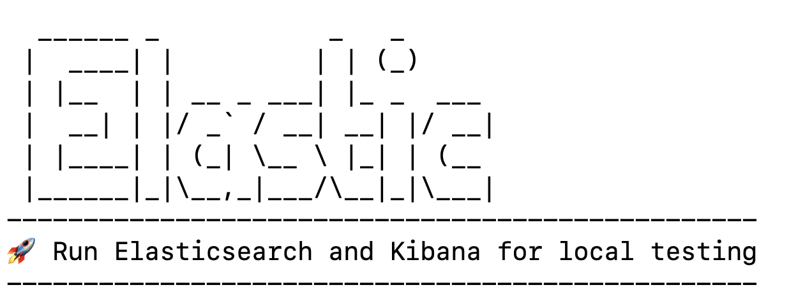

# Start ES for local testing 


- curl -fsSL https://elastic.co/start-local-podman | sh       




-------------------------------------------------
🚀 Run Elasticsearch and Kibana for local testing
-------------------------------------------------

ℹ️  Do not use this script in a production environment

⌛️ Setting up Elasticsearch and Kibana v9.3.1-arm64...

- Generated random passwords
- Created the /Users/prakash/stochasticQ/elastic-start-local folder containing the files:
  - .env, with settings
  - configuration files for Kibana and EDOT (if selected)
  - start/stop/uninstall commands
- Initializing and starting containers...

Creating network 'es-local-dev-net' ... done (created).
Creating container 'es-local-dev' from image 'docker.elastic.co/elasticsearch/elasticsearch:9.3.1-arm64' ... done (created).
Creating container 'kibana-local-dev' from image 'docker.elastic.co/kibana/kibana:9.3.1-arm64' ... done (created).
Starting container 'es-local-dev' ... done.
Waiting for 'es-local-dev' ... healthy.
Creating Elasticsearch API key ... done.
Setting up 'kibana_system' user password ... done.
Starting container 'kibana-local-dev' ... done.
Waiting for 'kibana-local-dev' ... healthy.

🎉 Congrats, Elasticsearch and Kibana are installed and running!

🌐 Open your browser at http://localhost:5601

   Username: elastic
   Password: abc***

🔌 Elasticsearch API endpoint: http://localhost:9200
🔑 API key: abc***********************************==

Learn more at https://github.com/elastic/start-local


# Execution steps

- start http://localhost:5601 in browser with user/password
- Modify the below accordingly

```
const char* api_key_env = std::getenv("ES_API_KEY");
        if (api_key_env == nullptr || std::string(api_key_env).empty()) {
            std::cerr << "ES_API_KEY is not set\n";
            std::cerr << "Run: export ES_API_KEY='your_api_key_here'\n";
            return 1;
        }

        const std::string api_key = api_key_env;

        EsClient client("http://localhost:9200", api_key);

```


- Execute

```
export ES_API_KEY='abc************************=='
prakash@MacBookPro build % ./test/es/es_crud_test

```