# Containers

Containers
Kubernetes
Openshift

2023
Cloud native
Industry changing revolution

Kubernetes -> Container orchestration

Logistics-> Containers

Container - docker 

Istio
Openshift

- management of containerized applications.
- Control plane, Nodes, Pods, Replica set, service, configmap, Ingress, Persistent vol
- Features - state management, auto scaling, self healing, multi-tenant isolation, rbac access control, 

- Digital container -> Encapsulation -> Build, ship and run applications
- Private, public cloud, isolation, efficient utilization, portability

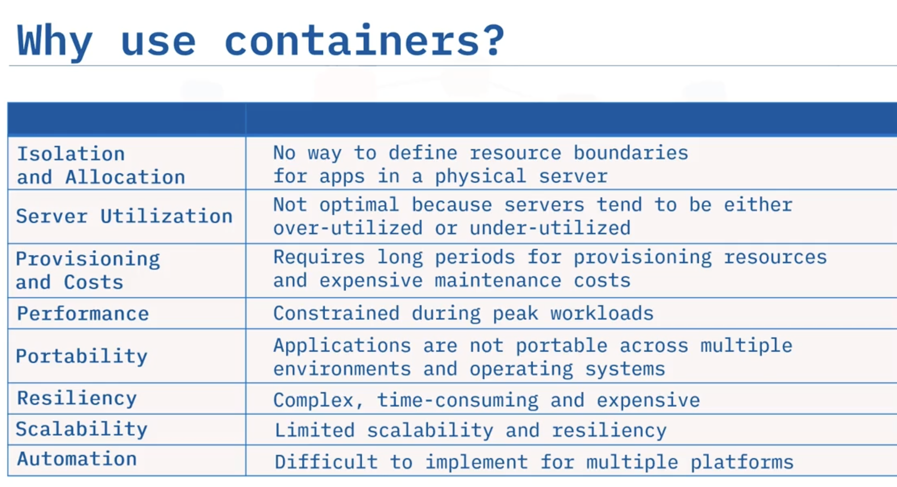

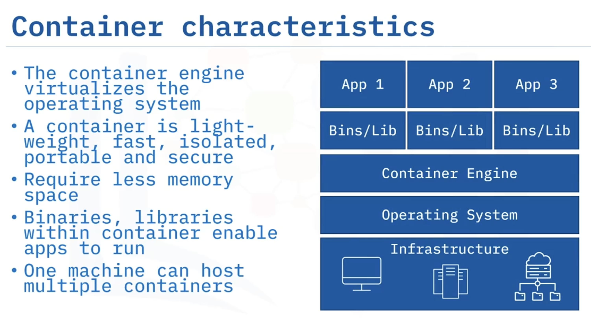

# Container Engine: Virtualizes the OS

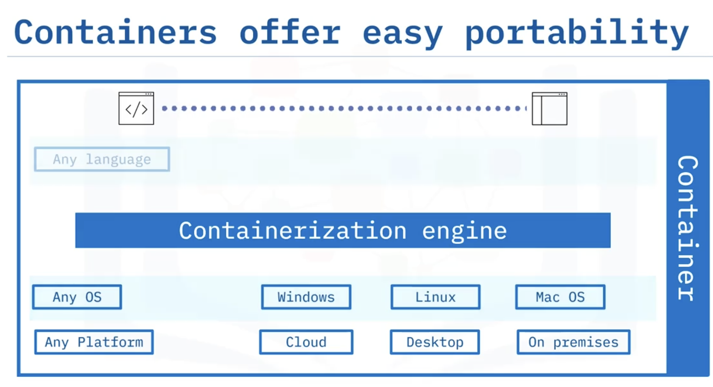
- any language - python java ..

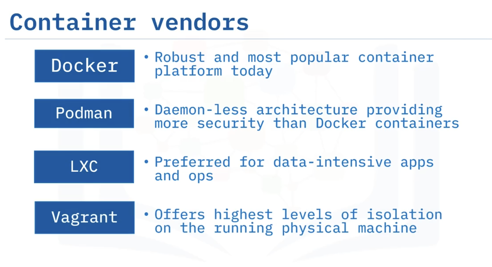

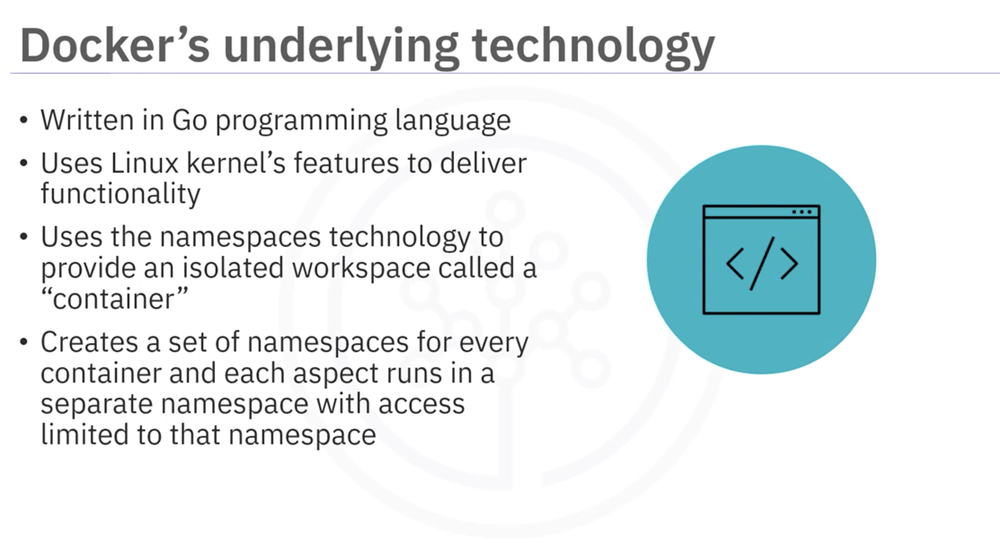

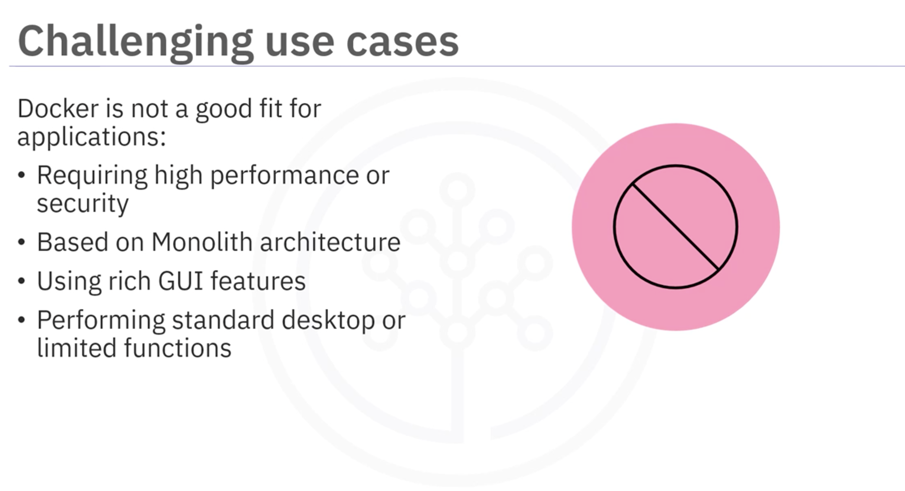

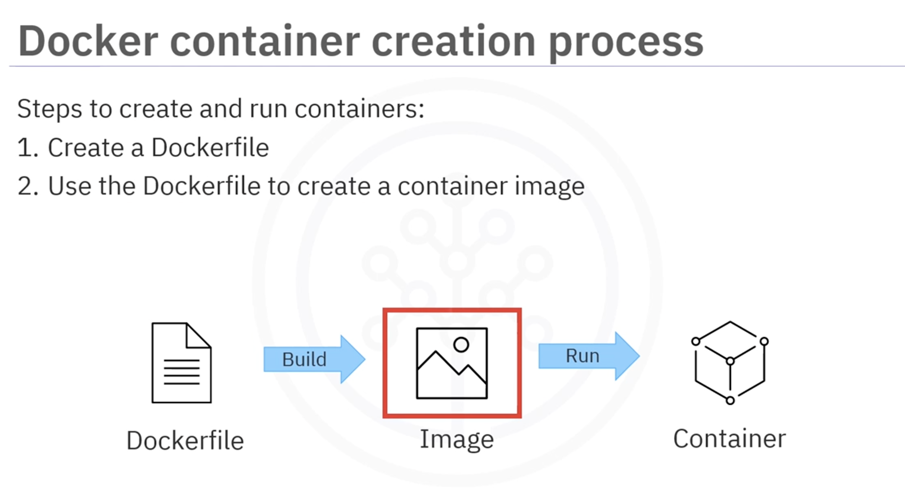

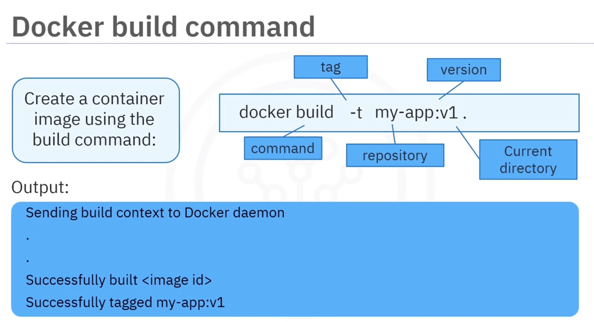
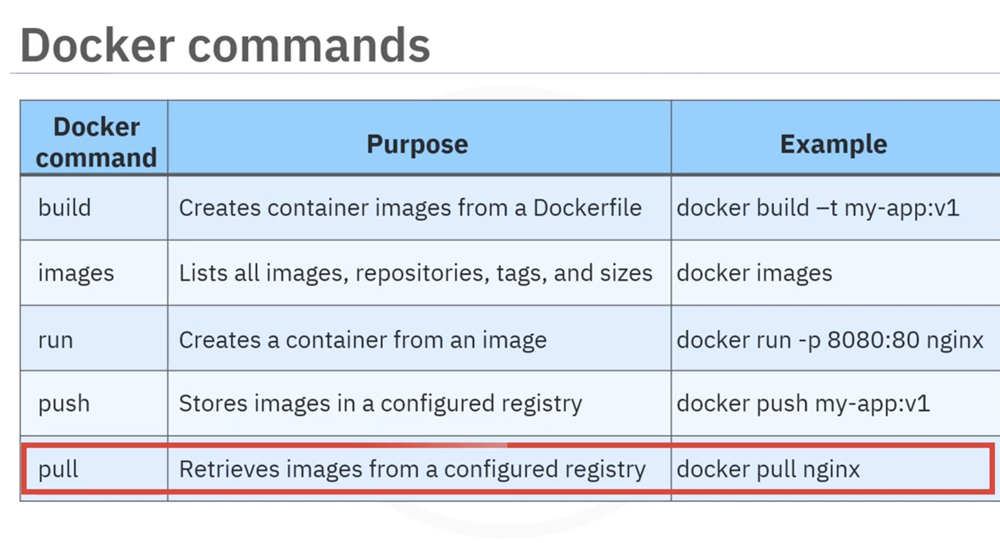

- build command used with a docker file to build an image
- run with an image to run it
- docker objects: 

- n/w, storage, plugins
- FROM 
- Base image
- public repo (go, node)
- run
- cmd (one cmd instruction - only last takes effect)
- image - readonly, new layer in the image
- 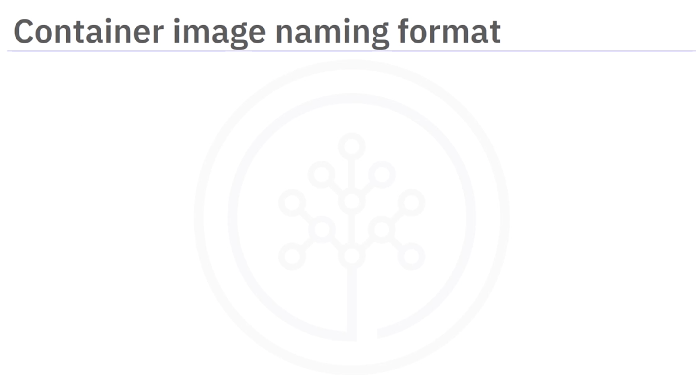
- docker.io/ubuntu/18.02 --> registry, repo, tag
- 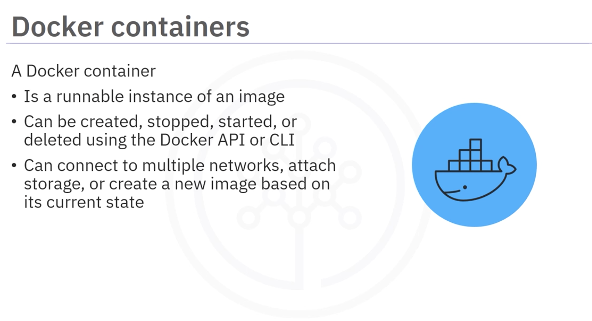
- 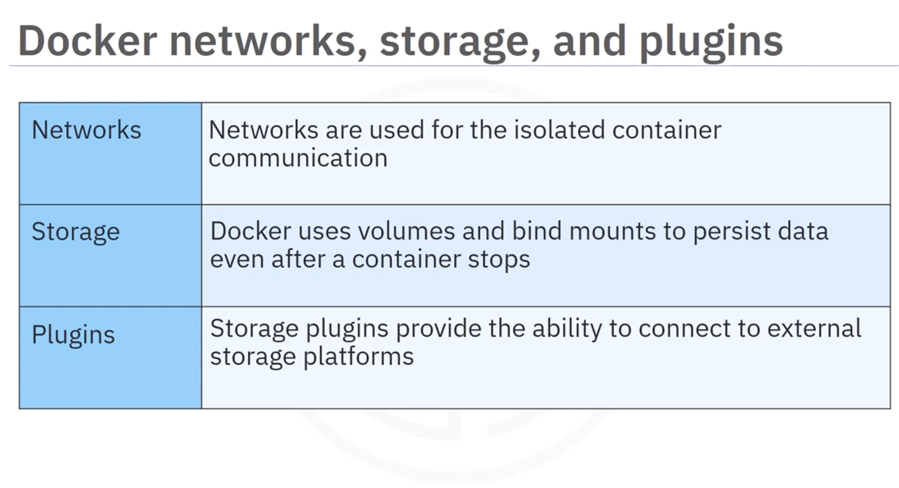
- 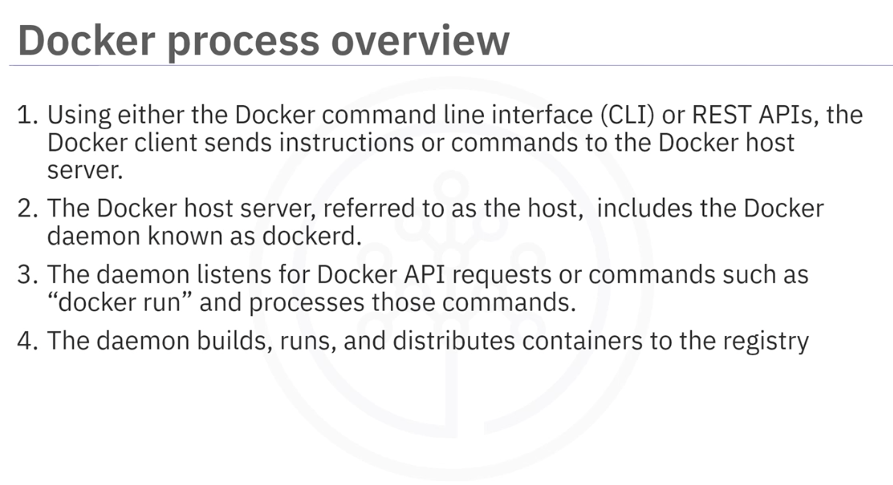
- 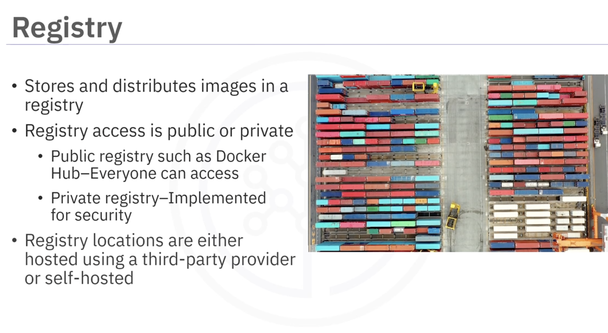
- 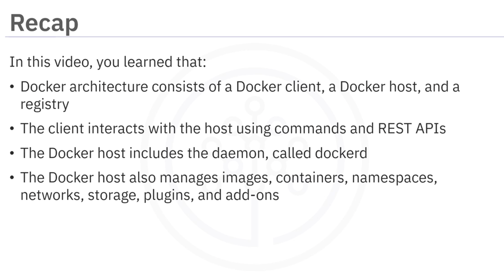

# Cmds

- docker --version
- ibmcloud version
- docker images
- docker pull hello-world
- docker container rm <container_id>
- docker ps -a
- docker build . -t myimage:v1

- 
   
    - FROM node:9.4.0-alpine
    
    - COPY app.js .

    - COPY package.json .
    
    - RUN npm install &&\
    
    - apk update &&\
    
    - apk upgrade
    
    - EXPOSE  8080
    
    - CMD node app.js
   

- 

