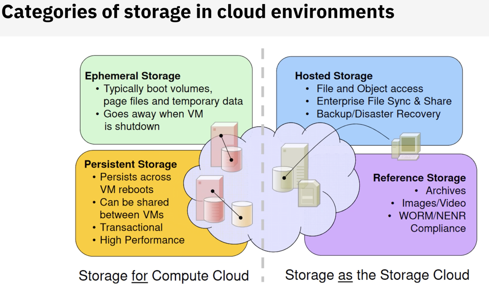
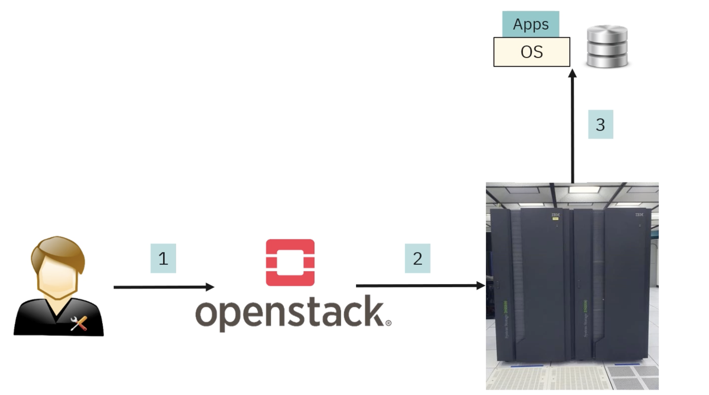

Plugin - that integrates openStack
Drivers for Openstack

Object Storage
Concurrent - unstructured - no downtime - 100TB - PB - XB
e.g IBM Cloud Object Storage
s3 api
Watson
Tiering
Aspera High-Speed
Access Management
cloud Tiering - transferring to cloud storage objest store
Admin can move data to cloud storag
IBM Cloud, Openstack Swift, Amazon S3

